# Penetration Test & Vulnerability Assessment Lab

A hands-on cybersecurity simulation where I was brought on as a **Penetration Tester** to run a full, end-to-end penetration test and vulnerability assessment against two of a client's servers, inside an isolated virtual network. The engagement covered the complete offensive security lifecycle: reconnaissance, vulnerability research, exploitation, privilege escalation, persistence, and post-exploitation data hunting.

## Project Overview

**Scenario:** A company needed its network security posture assessed before it could be trusted in production. I was hired as the penetration tester of record to import their Production Server and Web Server into a controlled lab environment, attack them the way a real adversary would, and report back exactly how they could be broken into.

**My role and duties as Penetration Tester:**
- Import a provided Production Server VM into a trusted network alongside a Web Server VM, and scan both from an attacker-controlled Kali Linux machine
- Perform deep network reconnaissance and port scanning with Nmap
- Research and formally document **four distinct vulnerabilities per server** (eight total) — name, CVE number, and CVSS severity score for each
- Weaponize the findings: exploit **at least two vulnerabilities per server** using Metasploit
- Achieve **root-level privilege escalation** on both systems, using a different exploit vector for each
- Prove administrative takeover was persistent by planting a **custom root backdoor account** on the Production Server
- Conduct post-exploitation data hunting for sensitive files on both servers
- **Bonus:** crack the Production Server's user account passwords from the stolen credential files

**Tools used:** Oracle VirtualBox, Kali Linux, Metasploit Framework, Nmap, John the Ripper, Netcat, NIST NVD (CVE/CVSS research)

### Virtual Machines in the Lab

| Machine | Zone | Role |
|---|---|---|
| Router-FW | Center | Firewall/router connecting all three network zones |
| Kali Linux (trusted) | Trusted NW `192.168.0.0/24` | My primary attack box |
| CEO PC | Trusted NW `192.168.0.0/24` | Client workstation |
| Production Server | Trusted NW `192.168.0.0/24` | Target #1 — imported client VM |
| DNS Server | DMZ `10.200.0.8/29` | Name resolution for the DMZ |
| Web Server | DMZ `10.200.0.8/29` | Target #2 |
| Kali Linux (untrusted) | Untrusted NW `172.30.0.0/24` | Simulated external attacker box |

### Network Architecture

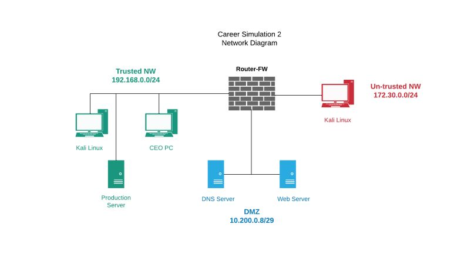

## Step-by-Step Breakdown

### Step 1: Reconnaissance — Scanning the Production Server

From Kali Linux, I ran an Nmap version-detection scan against the Production Server (`192.168.0.18`) with the `vuln` script set enabled, and saved the output to a file for documentation:

```bash
sudo nmap -sV 192.168.0.18 --script vuln > productionscan.txt
```

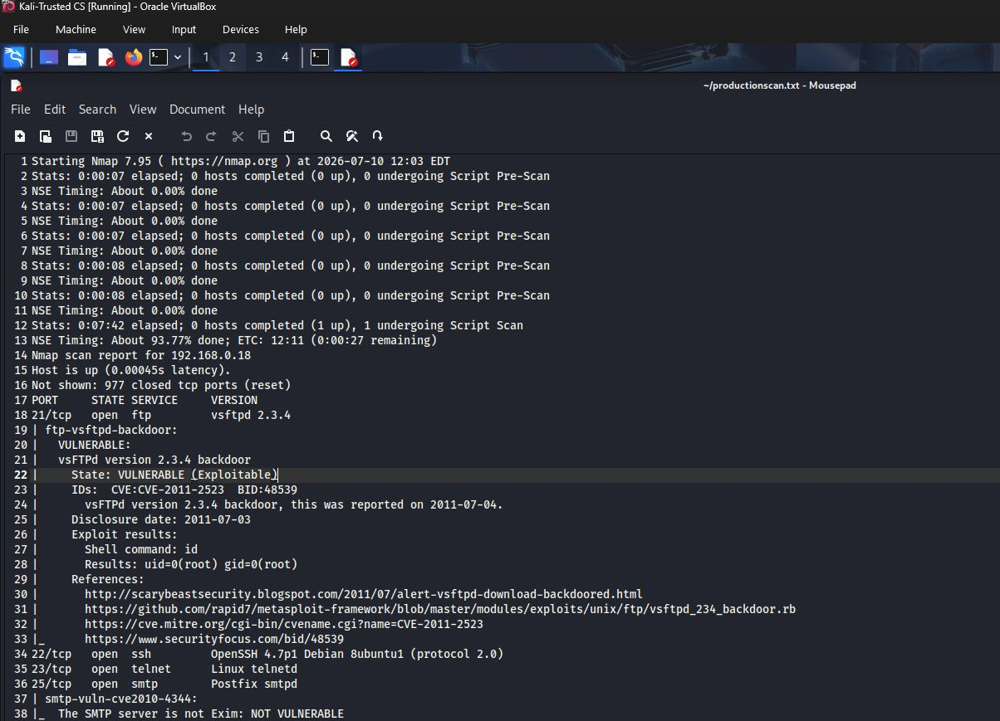

The scan immediately flagged the FTP service as running a known-vulnerable version — `vsFTPd 2.3.4` — which became my first documented finding.

### Step 2: Vulnerability Assessment — Production Server

I researched and documented four vulnerabilities present on the Production Server, recording each one's CVE ID and CVSS base score using the NIST National Vulnerability Database:

| # | Vulnerability | CVE | CVSS Score |
|---|---|---|---|
| 1 | vsFTPd version 2.3.4 backdoor | CVE-2011-2523 | **9.3 Critical** |
| 2 | OpenSSL cross-protocol attack on TLS via SSLv2 (DROWN) | CVE-2016-0800 | 5.9 Medium |
| 3 | SSL POODLE information disclosure | CVE-2014-3566 | 3.4 Low |
| 4 | rmi-vuln-classloader (Java RMI remote class loading) | CVE-2023-37895 | **9.8 Critical** |

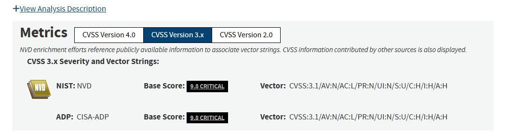
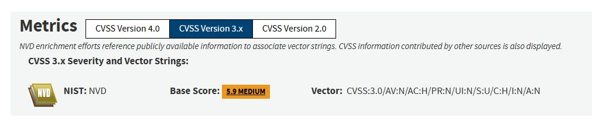
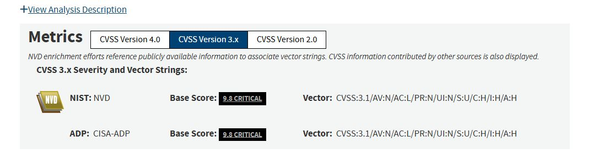
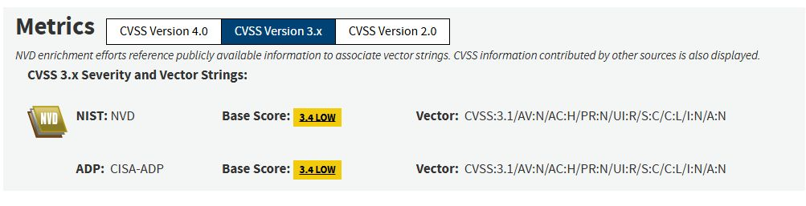

### Step 3: Exploiting the Production Server

With the vulnerabilities documented, I weaponized two of them in Metasploit to prove they were actually exploitable — not just theoretical.

**Exploit 1 — vsFTPd 2.3.4 backdoor:** On Kali, I launched `msfconsole`, selected the vsftpd backdoor exploit, and set `RHOSTS` to `192.168.0.18`. Running it dropped me straight into a root shell, confirmed with `whoami`.

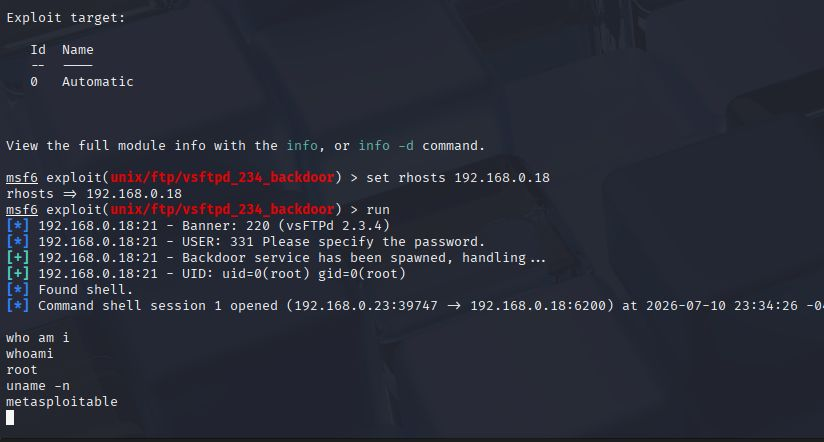

**Exploit 2 — Samba usermap script:** Using the same `msfconsole`, I searched for `samba`, selected module #15 (`exploit/multi/samba/usermap_script`), set `RHOSTS` to the Production Server's IP, and ran it. This gave me a second, independent path to root — a completely different exploit vector than the FTP backdoor.

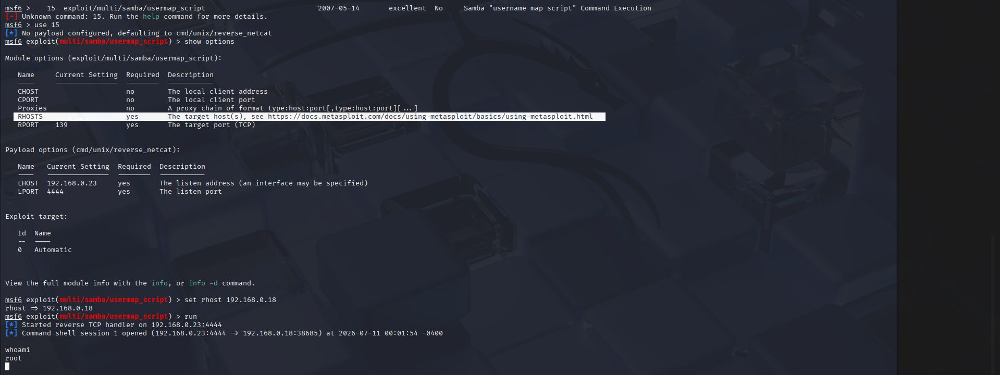

### Step 4: Reconnaissance — Scanning the Web Server

I repeated the same reconnaissance process against the Web Server (`10.200.0.12`) in the DMZ.

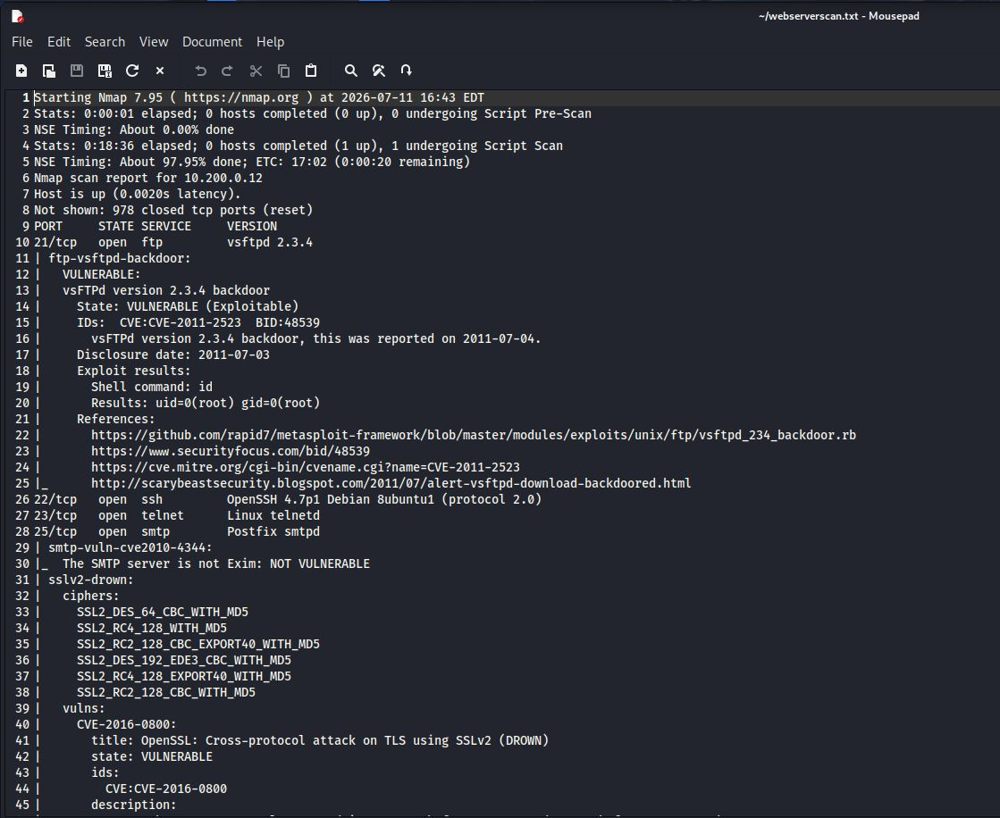

### Step 5: Vulnerability Assessment — Web Server

Four more vulnerabilities were researched and documented for the Web Server:

| # | Vulnerability | CVE | CVSS Score |
|---|---|---|---|
| 1 | Samba smbd 3.X–4.X netlogon vulnerability | CVE-2015-0240 | N/A (not yet scored) |
| 2 | Slowloris denial-of-service | CVE-2007-6750 | N/A (not yet scored) |
| 3 | OpenSSL cross-protocol attack on TLS via SSLv2 (DROWN) | CVE-2016-0800 | 5.9 Medium |
| 4 | SSL POODLE information disclosure | CVE-2014-3566 | 3.4 Low |

(#3 and #4 are the same TLS-stack vulnerabilities documented on the Production Server — both machines shared the exposure.)

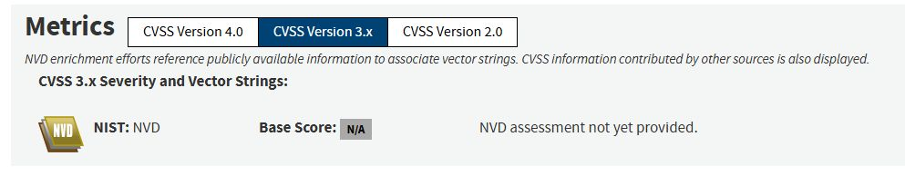
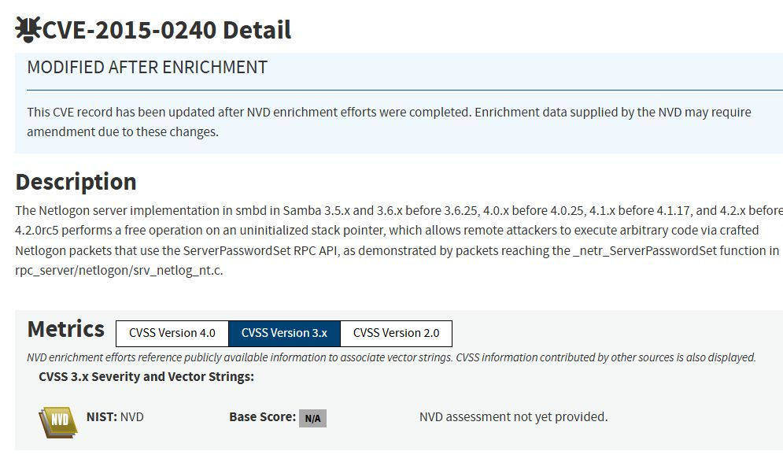

### Step 6: Exploiting the Web Server

**Exploit 1 — Samba usermap script:** Same Metasploit module as before, retargeted at the Web Server's IP (`10.200.0.12`). `whoami` confirmed root, and `uname -n` confirmed I'd landed on the web server specifically.

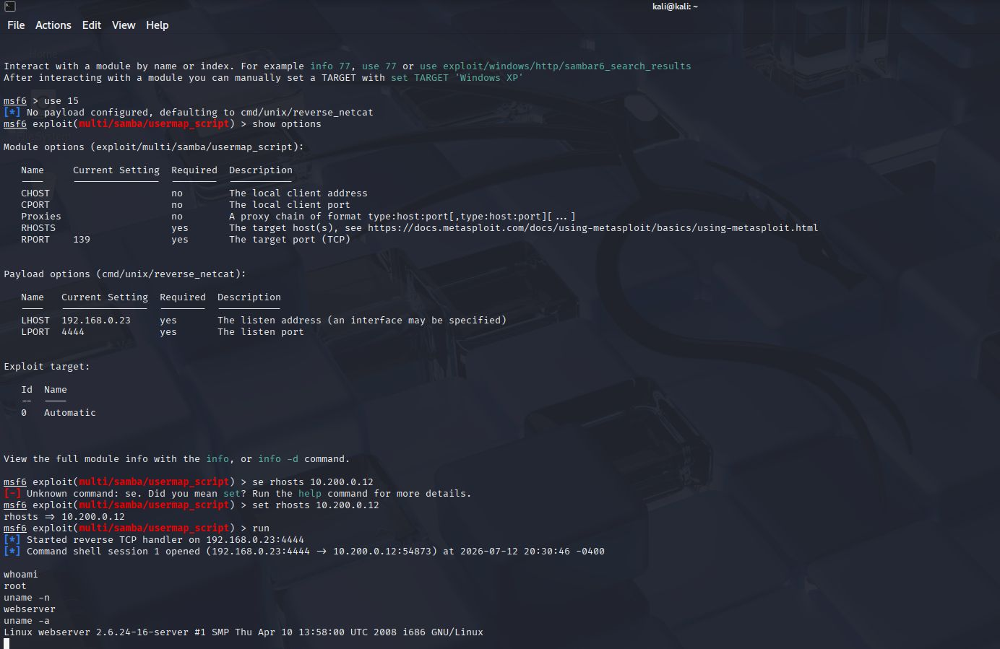

**Exploit 2 — Direct backdoor via Netcat:** I connected straight to a listening backdoor port with `nc 10.200.12 1524`, and `whoami` immediately returned root — a second, independent path to full compromise.

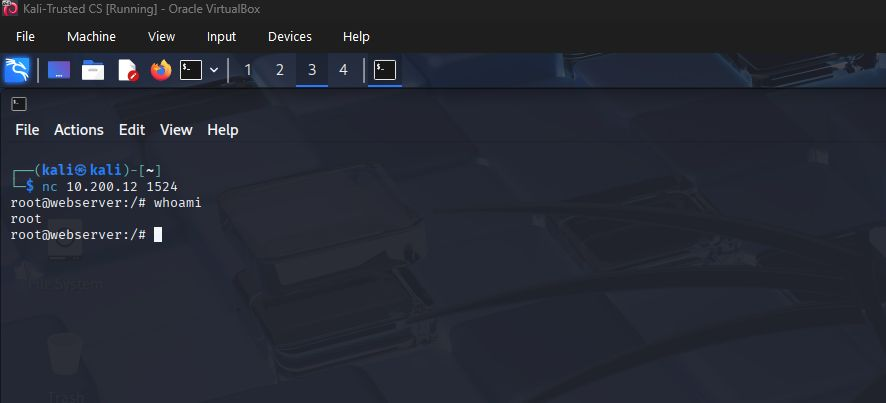

### Step 7: Extra Practice — Additional Exploit Attempts

Since practice makes perfect, I went past the two-exploit minimum and tried a few more angles:

- Re-ran the vsFTPd backdoor exploit against the Web Server itself and got the same clean root shell.

  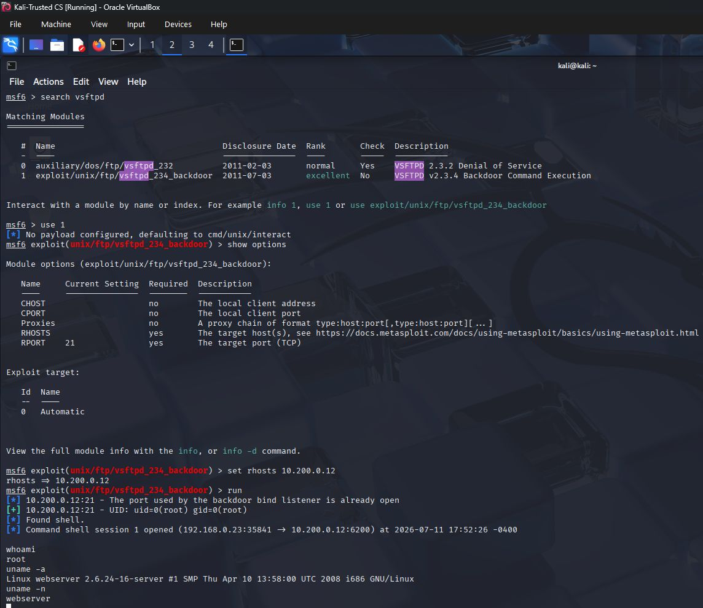

- Attempted a newer CVE (Ivanti Connect Secure RCE, CVE-2024-37404) against the environment — this one didn't land, which was a useful reminder that not every published exploit applies to every target.

  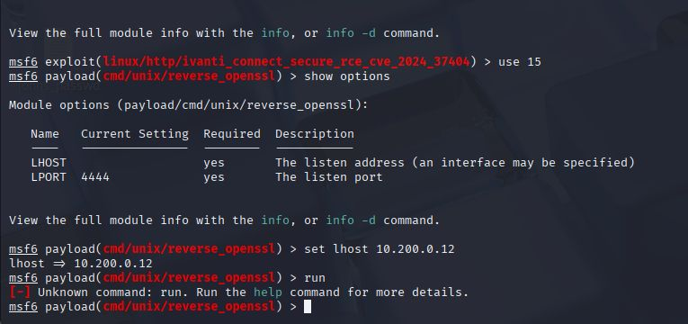

- Tried a couple of additional Netcat connections on other ports to see what else might be listening.

  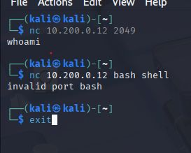

### Step 8: Establishing Persistence — Backdoor Account

To prove the takeover wasn't a one-time fluke, I used my root access on the Production Server to plant a custom backdoor account with `useradd -ou 0 -g 0`, giving it UID/GID `0` so it carried full root privileges, then set its password with `passwd`.

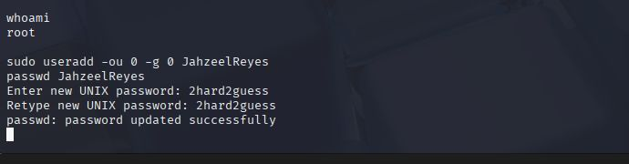

### Step 9: Post-Exploitation — Hunting for Sensitive Files

With root on both machines, I went looking for sensitive data an attacker would actually want.

**Production Server:** navigated into a `vulnerable` directory and found exposed MySQL SSL key material — private keys, certs, and requests sitting in plaintext files.

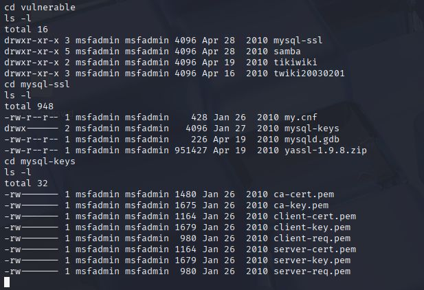

**Web Server:** walked the filesystem from `/` down through `/home`, and found a `stuff/safe-combination.txt` file sitting inside a user's home directory.

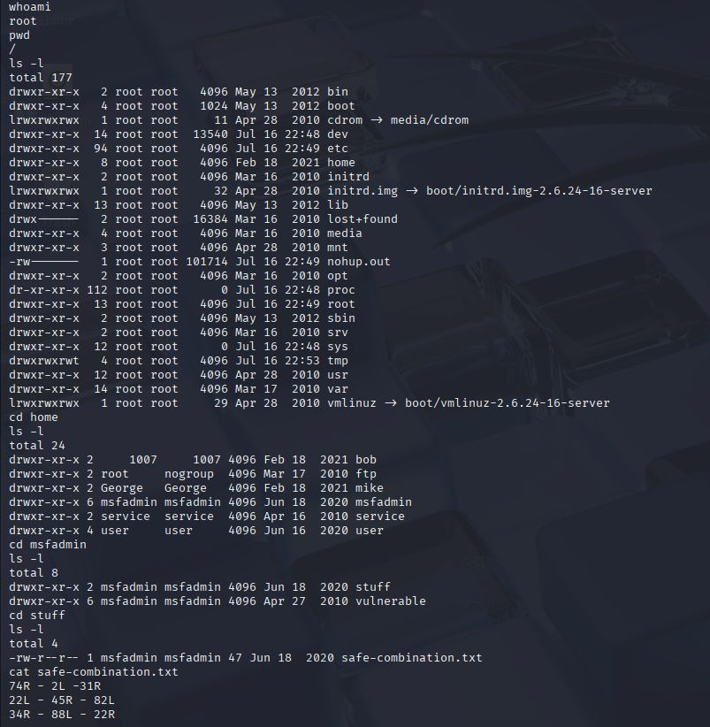

Reading that file (and others nearby) turned up what looked like planted personal records — names, job titles, addresses, and SSNs — exactly the kind of data exfiltration a real attacker would be hunting for.

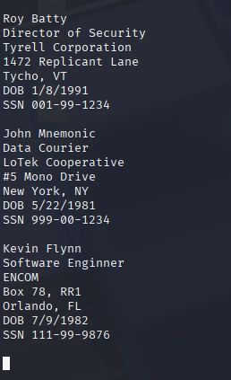

### Step 10: Bonus — Cracking User Credentials

For the bonus objective, I went after the Production Server's user account passwords. Still inside my Metasploit session, I downloaded `/etc/passwd` and `/etc/shadow-` to my Kali machine.

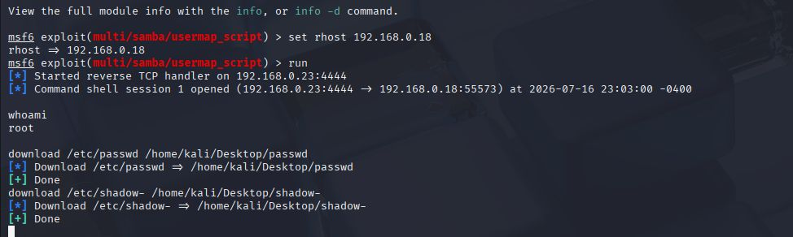

Back in a Kali terminal, I combined the two files with `unshadow`, then ran `john` against the combined file using a wordlist. In seconds, several accounts' passwords cracked in plaintext — including weak passwords like `123456789`, `batman`, and `password`.

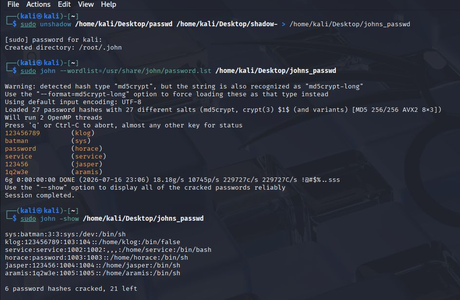

## Security Recommendations

Based on this engagement, I'd advise the client to:

- Patch or decommission the vsFTPd 2.3.4 and Samba usermap_script services immediately — both gave instant, unauthenticated root
- Disable SSLv2 entirely to close the DROWN and POODLE exposure on both servers
- Audit both servers for unauthorized accounts — an attacker who gets root can plant persistent backdoor users that survive a simple password reset
- Remove sensitive files (credentials, keys, personal records) from world-readable locations
- Enforce a real password policy — several account passwords cracked in under a minute with a basic wordlist

## What I Learned

My lifelong goal is to become a penetration tester, so this simulation was exactly the kind of work I wanted to get my hands on:

- How to pull files off a target and scan them for known vulnerabilities from Kali
- How to research whether a finding has a CVE, and how to read CVSS scores from NIST NVD
- How to actually exploit a documented vulnerability with Metasploit — not just identify it
- How to escalate to root and prove persistence by planting a backdoor account
- How to hunt a compromised system for sensitive files
- How to crack captured credentials with `unshadow` and John the Ripper

Beyond the offensive skills, this project sharpened how I think about defense too — once you've seen exactly how a server gets popped, it's a lot easier to picture what a defender needs to lock down first.

---
**By:** Jahzeel Reyes — Aspiring Penetration Tester
